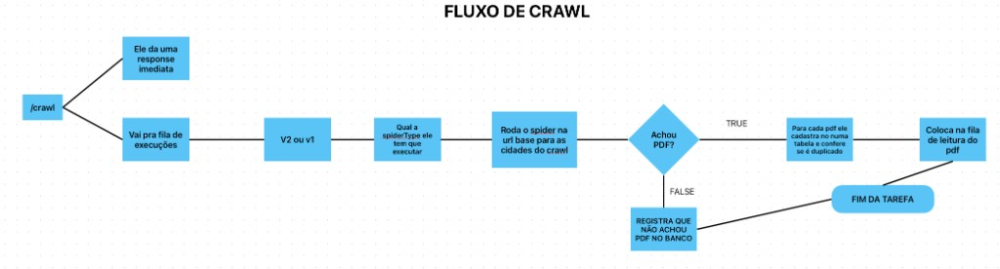
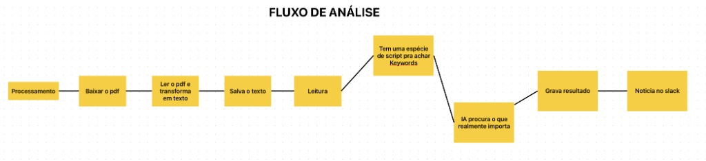

# Goodfellow

Pipeline completo para processamento de diários oficiais brasileiros usando **Cloudflare Workers** e **Queues**.

Crawl, OCR, análise por IA e entrega via webhooks — tudo em um único worker serverless.

## Visão Geral

O Goodfellow é um worker unificado que processa diários oficiais de **3.107 municípios** (55,8% de cobertura nacional) em 4 etapas sequenciais via filas:

```
HTTP Request
     │
     ▼
┌─────────────────────────────────────────────────────────────┐
│                        GOODFELLOW                           │
│                  (Worker Unificado)                          │
│                                                             │
│  goodfellow-crawl-queue ──▶ Crawl Processor                 │
│                                    │                        │
│  goodfellow-ocr-queue ────▶ OCR Processor                   │
│                                    │                        │
│  goodfellow-analysis-queue ▶ Analysis Processor             │
│                                    │                        │
│  goodfellow-webhook-queue ─▶ Webhook Processor              │
│                                    │                        │
│                              Webhook entregue               │
│                                                             │
│  Cada processador faz UMA tarefa e morre.                   │
│  Filas garantem resiliência e retry automático.              │
└─────────────────────────────────────────────────────────────┘
```

### Estágios do Pipeline

| Estágio | O que faz |
|---------|-----------|
| **Crawl** | Spiders raspam sites de diários, extraem metadados e URLs de PDFs. Registra no `gazette_registry` (deduplicação por URL do PDF). |
| **OCR** | Baixa PDFs, faz upload para R2, processa com Mistral OCR. Reutiliza resultados já existentes (~40% economia). |
| **Analysis** | Análise por IA (OpenAI) com detecção de concursos, licitações, decretos, etc. Seção-aware via V2 analyzers. |
| **Webhook** | Filtra por assinaturas, faz match de keywords e entrega notificações para endpoints configurados. |

#### Fluxo de Crawl



#### Fluxo de Análise (OCR → Analysis → Webhook)



## Estrutura do Repositório

```
goodfellow/
├── src/
│   ├── goodfellow-worker.ts          # Entry point (HTTP + Queue handlers)
│   ├── goodfellow/                   # Processadores de fila
│   │   ├── crawl-processor.ts
│   │   ├── ocr-processor.ts
│   │   ├── analysis-processor.ts
│   │   └── webhook-processor.ts
│   ├── spiders/                      # Sistema de spiders
│   │   ├── base/                     # ~410 implementações de spiders
│   │   ├── configs/                  # 26 configs V1 (por plataforma)
│   │   ├── registry.ts              # Factory V1
│   │   └── v2/                      # Sistema V2 (por território)
│   │       ├── configs/             # 27 configs por estado
│   │       ├── registry.ts          # Registry V2
│   │       ├── executor.ts          # Executor com strategies
│   │       └── README.md            # Guia detalhado dos spiders
│   ├── analyzers/                    # Análise de conteúdo
│   │   └── v2/                      # Analyzers section-aware
│   ├── services/                     # Serviços core
│   │   ├── database/                # Drizzle + D1
│   │   ├── mistral-ocr.ts           # Integração Mistral OCR
│   │   └── webhook-sender.ts        # Entrega de webhooks
│   ├── dashboards/                   # Dashboard web (React)
│   ├── routes/                       # Rotas HTTP (Hono)
│   ├── testing/                      # Framework de testes automatizados
│   ├── types/                        # Interfaces TypeScript
│   └── utils/                        # Utilitários
├── scripts/                          # Scripts de operação e testes
├── database/                         # SQL schemas (D1)
├── dev/                              # Setup de desenvolvimento local
├── docs/                             # Documentação detalhada
├── wrangler.jsonc                    # Configuração do worker
└── wrangler-r2.jsonc                 # Worker separado para servir PDFs
```

## Infraestrutura Cloudflare

| Tipo | Binding | Uso |
|------|---------|-----|
| **Queues** (4) | `CRAWL_QUEUE`, `OCR_QUEUE`, `ANALYSIS_QUEUE`, `WEBHOOK_QUEUE` | Pipeline de processamento |
| **DLQ** (4) | `goodfellow-*-dlq` | Dead letter queues para retry |
| **D1** | `DB` | Banco principal (gazette_registry, ocr_results, analysis_results, etc.) |
| **KV** (4) | `OCR_RESULTS`, `ANALYSIS_RESULTS`, `WEBHOOK_SUBSCRIPTIONS`, `WEBHOOK_DELIVERY_LOGS` | Cache e configurações |
| **R2** | `GAZETTE_PDFS` | Armazenamento de PDFs |
| **Browser** | `BROWSER` | Rendering para spiders que precisam de JS |

## Getting Started

### Pré-requisitos

- Node.js 18+ ou Bun
- Conta Cloudflare (para deploy)
- Mistral API key (para OCR)
- OpenAI API key (para análise)

### Instalação

```bash
bun install
```

### Desenvolvimento Local

```bash
# Com Cloudflare Tunnel (padrão)
bun run goodfellow:dev

# Com LocalTunnel (alternativa)
bun run goodfellow:dev:localtunnel

# Apenas localhost (mais rápido, sem tunnel)
bun run goodfellow:dev:localhost
```

O script de dev configura automaticamente D1, R2, tunnel e variáveis de ambiente. Veja [docs/DEVELOPMENT_SETUP.md](docs/DEVELOPMENT_SETUP.md) para detalhes.

### Variáveis de Ambiente (`.dev.vars`)

Copie o `.dev.vars.example` e preencha com suas chaves:

```bash
cp .dev.vars.example .dev.vars
```

```
MISTRAL_API_KEY=sua-chave-mistral
OPENAI_API_KEY=sua-chave-openai
API_KEY=chave-opcional-para-proteger-endpoints
R2_PUBLIC_URL=configurado-automaticamente-pelo-dev-script
LOCAL_DB_PATH=caminho-para-seu-sqlite-local
ENVIRONMENT=development
```

Para o `LOCAL_DB_PATH`, você precisa encontrar o arquivo `.sqlite` gerado pelo Wrangler na sua máquina. Rode o worker pelo menos uma vez (`bun run goodfellow:dev`) para que a pasta `.wrangler` seja criada, e depois execute:

```bash
find .wrangler -name "*.sqlite"
```

O resultado será algo como `.wrangler/state/v3/d1/miniflare-D1DatabaseObject/<hash>.sqlite`. Use esse caminho como valor de `LOCAL_DB_PATH`.

### Deploy

```bash
# Configurar secrets (apenas na primeira vez)
wrangler secret put MISTRAL_API_KEY --config wrangler.jsonc
wrangler secret put OPENAI_API_KEY --config wrangler.jsonc
wrangler secret put API_KEY --config wrangler.jsonc  # opcional

# Deploy
bun run deploy
```

## API Endpoints

Todos os endpoints (exceto `/`) requerem header `X-API-Key` quando `API_KEY` está configurado.

| Método | Rota | Descrição |
|--------|------|-----------|
| GET | `/` | Health check (público) |
| GET | `/spiders` | Lista spiders disponíveis |
| GET | `/spiders?type=sigpub` | Filtra por plataforma |
| GET | `/stats` | Estatísticas do sistema |
| GET | `/health/queue` | Status das filas |
| POST | `/crawl` | Crawl genérico |
| POST | `/crawl/cities` | Crawl de cidades específicas |
| POST | `/crawl/today-yesterday` | Crawl de hoje e ontem |
| POST | `/crawl/pdfs` | Processar PDFs já registrados |
| GET | `/dashboard` | Dashboard web |
| GET | `/dashboard/ai-costs` | Custos de IA |

### Exemplos

```bash
# Crawl de cidades específicas
curl -X POST https://goodfellow-prod.qconcursos.workers.dev/crawl/cities \
  -H "X-API-Key: sua-chave" \
  -H "Content-Type: application/json" \
  -d '{"cities": ["am_1300144", "ba_2927408"], "startDate": "2025-10-01", "endDate": "2025-10-03"}'

# Crawl hoje/ontem por plataforma
curl -X POST https://goodfellow-prod.qconcursos.workers.dev/crawl/today-yesterday \
  -H "X-API-Key: sua-chave" \
  -H "Content-Type: application/json" \
  -d '{"platform": "sigpub"}'

# Listar spiders
curl https://goodfellow-prod.qconcursos.workers.dev/spiders \
  -H "X-API-Key: sua-chave"
```

## Scripts Disponíveis

### Testes

| Comando | O que faz |
|---------|-----------|
| `bun run test:city <id>` | Testa crawl de uma cidade específica |
| `bun run test:platform <plataforma>` | Testa todas as cidades de uma plataforma |
| `bun run test:automated` | Suite automatizada (modo sample por padrão) |
| `bun run test:automated:full` | Suite completa (todas as cidades) |
| `bun run test:local -- --city <id>` | Pipeline completo local (crawl→OCR→analysis→webhook) |
| `bun run test:v2-ocr -- --cities <ids>` | Teste V2 end-to-end com validação de OCR |

### Operações

| Comando | O que faz |
|---------|-----------|
| `bun run remote:crawl today-yesterday` | Dispara crawl remoto no worker de produção |
| `bun run remote:crawl cities <ids>` | Crawl remoto de cidades específicas |
| `bun run remote:crawl stats` | Estatísticas do worker |
| `bun run remote:crawl health` | Health check remoto |

### Banco de Dados

| Comando | O que faz |
|---------|-----------|
| `bun run setup:d1` | Configura tabelas D1 |
| `bun run db:generate` | Gera migrações Drizzle |
| `bun run db:studio:local` | Abre Drizzle Studio local |

## Plataformas Suportadas

| Plataforma | Cidades | Plataforma | Cidades |
|------------|---------|------------|---------|
| SIG Pub | 1.723 | DOEM | 56 |
| Diário BA | 407 | DOSP | 42 |
| DOM-SC | 295 | ADiarios V1 | 34 |
| Instar | 111 | MunicípioOnline | 26 |
| Atende V2 | 22 | Acre | 22 |
| DIOF | 20 | Outras | ~100 |
| **Total** | **3.341 configs** | **Únicos** | **3.107 municípios** |

## Documentação Adicional

| Doc | Conteúdo |
|-----|----------|
| [docs/ARCHITECTURE.md](docs/ARCHITECTURE.md) | Arquitetura completa do sistema |
| [docs/DEVELOPMENT_SETUP.md](docs/DEVELOPMENT_SETUP.md) | Setup detalhado de desenvolvimento |
| [docs/SECURITY.md](docs/SECURITY.md) | Autenticação e segurança |
| [docs/QUICK_START.md](docs/QUICK_START.md) | Guia rápido |
| [src/spiders/v2/README.md](src/spiders/v2/README.md) | Sistema de spiders (como testar, criar, operar) |
| [src/analyzers/v2/README.md](src/analyzers/v2/README.md) | Sistema de análise V2 |

## License

MIT
